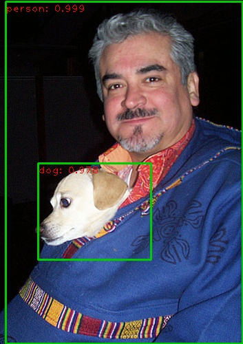

# Faster RCNN with pytorch
To better understand the details in the [faster rcnn](https://arxiv.org/abs/1506.01497), I referenced many great projects and tried to reimplement this classic algorithm.

## Acknowledge
During finishing this work, I have referenced a lot of gread work, including:
- [jwyang/faster-rcnn.pytorch](https://github.com/jwyang/faster-rcnn.pytorch) (mainly)
- [ruotianluo/pytorch-faster-rcnn](https://github.com/ruotianluo/pytorch-faster-rcnn)

I aimed to learn about this algorithm, so the code is very simple and only support batchsize == 1. I recommend jwyang/faster-rcnn.pytorch. This project is very powerful and the code is very clear. I got very good perfomance on their project.

## Installing and Preparing for data/model
step 0: **Download**
```
git clone https://github.com/zhoulukuan/faster_rcnn_pytorch
```
step 1: **Install pytorch 0.4.0 and torchvision**

I only test my work on pytorch 0.4.0 and ubuntu. Follow the step in [pytorch official website](https://pytorch.org/get-started/previous-versions/) according to your CUDA version.

step 2: **Install Python Package**
```
pip install -r requirement
```
Among them, tensorflow is necessary for tensorboardX. If you don't want to use them for visualization, delete them from the list.

step 3: **Dataset preparation**
I only train my model on COCO. The dataset should be stored in ./data(default. You can change it in trainval.py).
```
data
  |- coco
  	|- annotations #label
  	|- images  #images
```

step 4: **Pretrained Model**
For better results, pretrained model of resnet on ImageNet for initialization is necessary. You can dowoload it from [here](). It should be saved in ./data as well.


## Usage
### Demo
Test on a single image could be done bu running
```
python demo.py --img_path path/to/your/img_folder --model path/to/my/trained/model
```
You can get a similar image as follow:



Result image will be saved as **OriginName_det.jpg** in the same folder.

### Train
Training your own model could be done by running:
```
python trainval.py
```
Change command line arguments if necessary. You can read `def parse_args()` in `trainval.py` to learn about them. Hyperparametres such as learning rate can be set by changing `cfgs/res101.yml`. You can find most of the commonly used hyperparameters in this file. There are some  other hyperparameters in the `utils/config.py`, but most of the time you don't need to change them.

### Test
Testing your trained model could be done by running:
```
python test.py --model=path/to/your/model
```
You can see the final result after 30-40 minutes.

### TensorboardX
Monitor your training process with tensorboardX. Different losses are saved in different folders. Run:
```
tensorboard --logdir=$FASTER_RCNN_PYTORCH/logs/$FOLDER_NAME --port=7001
```
Then open your firefox or chrome, and visit localhost:7001. 

## Result
I got a 33.9 mAP on resnet-101(Train/Test: coco_train+coco_val-minival/minival, scale=600, RoiAlign). Further improvement work is under experiment.

## Todo
[ ] Reproduce the results in jwyang

[ ] Support multi gpu

[ ] Support batch size > 1